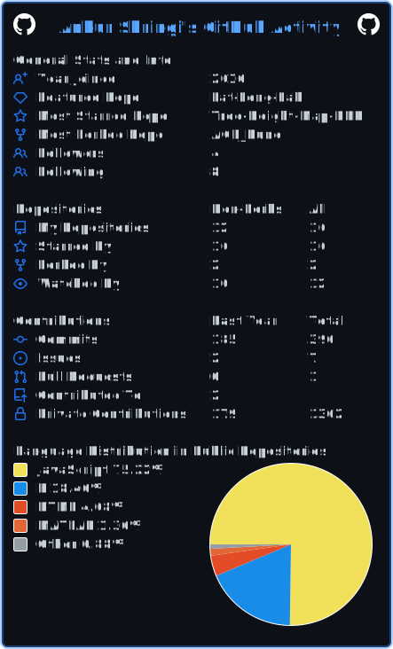

Ankur Shringi

Researcher at Indian Institute of Science, Bengaluru, India

  
  

Language Stats

<!-- LANGS:START -->
|||
|---|---|
| JavaScript | [███████████████░░░░░] 75.22% |
| R | [████░░░░░░░░░░░░░░░░] 18.46% |
| HTML | [█░░░░░░░░░░░░░░░░░░░] 4.08% |
| MATLAB | [░░░░░░░░░░░░░░░░░░░░] 1.36% |
| CSS | [░░░░░░░░░░░░░░░░░░░░] 0.65% |
| Java | [░░░░░░░░░░░░░░░░░░░░] 0.23% |
|||
<!-- LANGS:END -->

View My Detailed GitHub Activity

  
If you want to generate the equivalent to the above for your own GitHub profile,
check out the <a href="https://github.com/cicirello/user-statistician">cicirello/user-statistician</a>
GitHub Action.

<!-- DATE:START -->Last Updated: January 27, 2026 at 10:27:29 AM UTC
<!-- DATE:END -->
